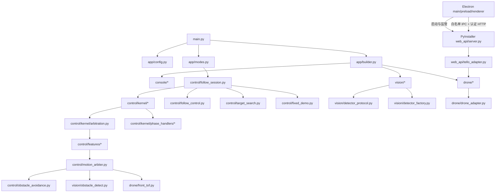
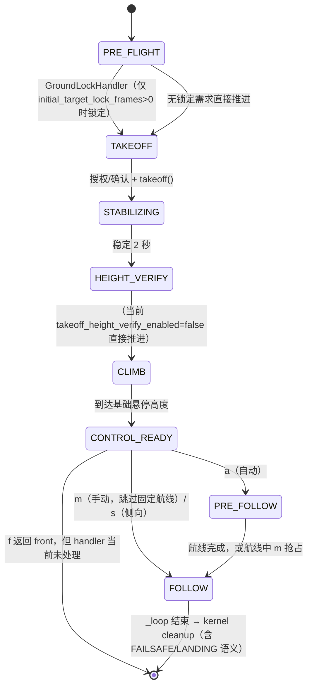

# 02 · 系统架构与生命周期

> [返回总入口](README.md) · 上一篇：[01-功能与运行模式](01-功能与运行模式.md) · 下一篇：[03-视觉感知与目标跟随](03-视觉感知与目标跟随.md)
>
> 本文从依赖装配出发，说明模块依赖、`FollowSession`/`KernelSession` 混合架构、生命周期 phase FSM、单 tick 时序、并发与资源清理，以及正常自治 RC 出口与安全清零例外。

## 1. 模块依赖图



- **端口与适配器**：`DroneAdapter`（抽象基类，[drone/drone_adapter.py:7](../drone/drone_adapter.py#L7)）→ `TelloDroneAdapter`（真机，唯一直接导入 `djitellopy` 的模块）/ `FakeDroneAdapter`（模拟）。其他模块只依赖接口。
- **Feature-SDK**：`MotionFeature` 协议 → `FeatureProposal` / `ArbitrationContext`（[control/kernel/features.py:27](../control/kernel/features.py#L27)）；`ArbitrationEngine` 每 tick 选一个运动所有者（[control/kernel/arbitration.py:42](../control/kernel/arbitration.py#L42)）。
- **检测器契约**：`DetectorProtocol`（[vision/detector_protocol.py:9](../vision/detector_protocol.py#L9)）→ `PersonReIDDetector`；`create_detector` 是唯一装配入口（[vision/detector_factory.py:18](../vision/detector_factory.py#L18)）。
- **两个运行入口**：CLI 自动跟随通过 `FollowSession/KernelSession`；桌面 sidecar 通过 `DroneWebService` 直接拥有一个真机适配器，只提供手动 RC，不进入 ReID 与内核 phase FSM。

## 2. 装配根：`app/builder.py`

| 函数 | 行号 | 职责 |
|------|------|------|
| `build_safety_manager` | [app/builder.py:26](../app/builder.py#L26) | 从 `config.yaml` 建 `SafetyManager` |
| `build_obstacle_modules` | [app/builder.py:31](../app/builder.py#L31) | 仅当 `obstacle.enabled` 为真才建 `DistanceOnlyObstacleDetector` + `ObstacleAvoidancePlanner` + `MotionArbiter`；否则三元组全为 `None` |
| `create_drone_adapter` | [app/builder.py:51](../app/builder.py#L51) | `use_fake` → `FakeDroneAdapter`；否则按 `flight_audit` 配置构造 `TelloDroneAdapter` |
| `build_system` | [app/builder.py:83](../app/builder.py#L83) | 组装 Console：`load_runtime_config` → `SafetyManager` → `create_detector` → `FollowController` → `build_obstacle_modules` → `ConsoleTools` → `LLMClient` → `CommandParser` → `ConsoleController` |

关键点：

- `build_obstacle_modules` 生产装配统一走 `MotionArbiter`；`ConsoleTools` 还接受单独的 detector/planner 参数仅作**直接装配（测试）回退**（[app/builder.py:104](../app/builder.py#L104)）。
- Fake 起飞时直接置 `height_cm = base_hover_height_cm`（配置当前值 150 cm，代码缺省 70），与真机起飞后闭环爬升到同一高度的方式**不同**：Fake 瞬时到位，真机渐进爬升（[app/builder.py:73](../app/builder.py#L73)）。

### 2.1 桌面端独立运行时

Electron 主进程启动并监管一个本机 sidecar：

```text
renderer → 类型化 preload IPC → Electron main → 带会话令牌的随机回环端口
                                              ↓
                                  ThreadingHTTPServer / DroneWebService
                                              ↓
                                  RealTelloAdapter / TelloDroneAdapter
```

`DroneWebService` 用 `RLock` 串行保护适配器与遥测状态，并启动两个 daemon 线程：
0.4 s RC 失联看门狗和 0.2 s 前向 ToF 轮询。HTTP 只绑定 `127.0.0.1` 且所有接口要求
会话认证；服务在收到 `POST /api/drone/connect` 前不会连接无人机或请求视频。

## 3. 混合架构：FollowSession ↔ KernelSession

`FollowSession`（[control/follow_session.py:42](../control/follow_session.py#L42)，2265 行）不是纯薄壳。它持有：

- 构造签名与公共 API（`send_command` [control/follow_session.py:1083](../control/follow_session.py#L1083)、`send_motion_command` [control/follow_session.py:1100](../control/follow_session.py#L1100)、`handle_key` [control/follow_session.py:1194](../control/follow_session.py#L1194)、`request_stop` [control/follow_session.py:1277](../control/follow_session.py#L1277)、`request_emergency_stop` [control/follow_session.py:1284](../control/follow_session.py#L1284)）。
- 传感器与遥测：`_read_battery`（[control/follow_session.py:2164](../control/follow_session.py#L2164)）、`_read_height`（[control/follow_session.py:2185](../control/follow_session.py#L2185)，中位数滤波）、`_read_yaw`（[control/follow_session.py:2177](../control/follow_session.py#L2177)）。
- 朝向模式：侧向/前向控制器、模式切换确认、0.5 s 丢失去抖和两个异步日志记录器。
- 阻塞子循环：`_wait_for_initial_target_lock`（[control/follow_session.py:225](../control/follow_session.py#L225)）、`_reach_base_hover_height`（[control/follow_session.py:559](../control/follow_session.py#L559)）、`_loop`（[control/follow_session.py:1783](../control/follow_session.py#L1783)）。
- 资源生命周期：`_start_camera`（[control/follow_session.py:2087](../control/follow_session.py#L2087)）、`_prepare_front_tof`（[control/follow_session.py:2104](../control/follow_session.py#L2104)）、`_safe_zero_output`（[control/follow_session.py:2204](../control/follow_session.py#L2204)）、`_safe_land`（[control/follow_session.py:2211](../control/follow_session.py#L2211)）、`_stop_camera`（[control/follow_session.py:2231](../control/follow_session.py#L2231)）、`_destroy_window`（[control/follow_session.py:2242](../control/follow_session.py#L2242)）。

`KernelSession`（[control/kernel/session.py:19](../control/kernel/session.py#L19)）拥有：

- 工作循环：`run()`（[control/kernel/session.py:25](../control/kernel/session.py#L25)）。
- 单 RC 发射缝：`_emit()`（[control/kernel/session.py:70](../control/kernel/session.py#L70)）。
- Feature fail-safe：`_failsafe()`（[control/kernel/session.py:84](../control/kernel/session.py#L84)）。
- finally 清理：`_land_and_cleanup()`（[control/kernel/session.py:95](../control/kernel/session.py#L95)）。

## 4. 生命周期 phase FSM

`KernelPhase` 枚举声明了 10 个阶段（[control/kernel/phases.py:14](../control/kernel/phases.py#L14)），但**当前普通 handler 只注册到 FOLLOW**（[control/kernel/phase_handlers/__init__.py:30](../control/kernel/phase_handlers/__init__.py#L30)）：



- 声明但**未注册**的 `FAILSAFE` / `LANDING`：主要落地与清理由 `KernelSession.run()` 的 `finally: self._land_and_cleanup()` 完成（[control/kernel/session.py:61](../control/kernel/session.py#L61)）。handler 返回 `None` 时同样走到 finally 清理。
- `KernelSession.run()` 逐阶段调用 handler，`phase = handler.run(session, ctx)`；`handlers.get(phase)` 为 `None` 时 `break`（[control/kernel/session.py:53](../control/kernel/session.py#L53)）。
- 阶段子循环主体仍留在 `FollowSession`（如 `_reach_base_hover_height`、`_loop`），以便现有测试 patch `control.follow_session.sleep/monotonic`（[control/kernel/session.py:6](../control/kernel/session.py#L6)）。

### 各 handler 语义

| Handler | 文件 | 行为 |
|---------|------|------|
| `GroundLockHandler` | `phase_handlers/ground_lock.py` | 仅当 `initial_target_lock_frames > 0` 时调用 `_wait_for_initial_target_lock` |
| `TakeoffHandler` | `phase_handlers/takeoff.py` | 授权/确认 + fresh-target 复核 → `drone.takeoff()` → 启动前向 ToF（[takeoff.py:19](../control/kernel/phase_handlers/takeoff.py#L19)） |
| `StabilizeHandler` | `phase_handlers/stabilize.py` | 2 秒稳定 |
| `HeightVerifyHandler` | `phase_handlers/height_verify.py` | 独立离地高度确认（默认关闭） |
| `ClimbHandler` | `phase_handlers/climb.py` | `_reach_base_hover_height` 垂直爬升，忽略前向 ToF（[climb.py:18](../control/kernel/phase_handlers/climb.py#L18)） |
| `ControlReadyHandler` | `phase_handlers/control_ready.py` | 基础高度持续悬停；`m/s` 进 FOLLOW，`a` 进 PRE_FOLLOW；当前遗漏 `front` 返回值 |
| `PreFollowHandler` | `phase_handlers/pre_follow.py` | fixed-demo 航线（`pre_follow_maneuver`），完成后 `_reset_tracking_state` 进 FOLLOW（[pre_follow.py:18](../control/kernel/phase_handlers/pre_follow.py#L18)） |
| `FollowHandler` | `phase_handlers/follow.py` | 置 `MANUAL` 或 `FOLLOWING` → `session._loop()`；`_loop` 返回 `None` 结束 FSM（[follow.py:18](../control/kernel/phase_handlers/follow.py#L18)） |

## 5. 单 tick 时序（FOLLOW 阶段）

`FollowSession._loop()`（[control/follow_session.py:1783](../control/follow_session.py#L1783)）每个 tick：

```mermaid
sequenceDiagram
    participant L as FollowSession._loop
    participant D as Detector
    participant A as ArbitrationEngine
    participant K as KernelSession._emit
    participant S as SafetyManager
    participant Dr as DroneAdapter

    L->>D: detect(frame)
    alt 检测异常
        L-->>K: _kernel._failsafe(exc)（清零）
        L->>L: engine_failures 计数→降落
    end
    alt 正在模式切换
        L->>L: 悬停 + ReID 连续确认；丢失则搜索
    else 侧向/前向且非手动
        L->>L: SideFollowController + TargetSearchController（绕过 A）
    else 普通/手动
        L->>A: arbitrate(ArbitrationContext)
    end
    alt outcome.requires_landing
        L->>L: _safe_zero_output() → break
    end
    L->>L: battery=_read_battery(); height=_read_height()
    alt battery低 / 超高 / lost_land
        L->>L: 置 landing 状态 → break
    end
    L->>K: send_command(command) → _emit()
    K->>S: limit_rc_command(...)
    K->>Dr: move_rc(...)
    L->>L: fps/control_hz 统计 + cv2.imshow + waitKey
```

实际实现位置：

- 读帧 [control/follow_session.py:1848](../control/follow_session.py#L1848)；检测 [control/follow_session.py:1878](../control/follow_session.py#L1878)；yaw [control/follow_session.py:1901](../control/follow_session.py#L1901)。
- 模式切换/朝向旁路 [control/follow_session.py:1903](../control/follow_session.py#L1903)；普通仲裁 [control/follow_session.py:1944](../control/follow_session.py#L1944)；`requires_landing` [control/follow_session.py:1983](../control/follow_session.py#L1983)。
- 电量/高度检查 [control/follow_session.py:1996](../control/follow_session.py#L1996) 起；低电 [control/follow_session.py:2034](../control/follow_session.py#L2034)；超高 [control/follow_session.py:2040](../control/follow_session.py#L2040)；`lost_land` [control/follow_session.py:2049](../control/follow_session.py#L2049)。
- 发射 `send_command` [control/follow_session.py:2054](../control/follow_session.py#L2054)；控制率告警 [control/follow_session.py:2064](../control/follow_session.py#L2064)。

### 按运行时隔离的 RC 出口

- **CLI FollowSession**：`KernelSession._emit()`（[control/kernel/session.py:70](../control/kernel/session.py#L70)）统一承接自治、手动和 `_safe_zero_output`，经 `SafetyManager.limit_rc_command` 后调用 `move_rc`。
- **Console 工具**：`ConsoleTools._send_safe_rc` 是任务调度层的独立安全出口。
- **桌面端**：`DroneWebService.move_rc/_send_hover` 使用本地服务常量限幅和看门狗，是另一个独立运行时出口。
- 因此“单出口”只在一个 `FollowSession` 会话内部成立，不是全仓库字面事实。

## 6. 并发与资源所有权

| 资源 | 所有者 | 并发保护 |
|------|--------|----------|
| 生命周期临界区 | `KernelSession.run` / `TakeoffHandler` | `session._lifecycle_lock`（[control/follow_session.py:109](../control/follow_session.py#L109)） |
| Console 任务注册表 | `ConsoleTools` | `self._task_lock`（[console/tools.py:60](../console/tools.py#L60)） |
| Console 零命令发射 | `ConsoleTools` | `self._control_lock`（[console/tools.py:59](../console/tools.py#L59)） |
| 前向 ToF 缓存 | `FrontToFMonitor` | 内部 `self._lock`（[drone/front_tof.py:38](../drone/front_tof.py#L38)）；控制循环只读 `snapshot()` |
| 日志写入 | `_JsonlEventWriter` | 有界队列 256（[control/motion_arbiter.py:458](../control/motion_arbiter.py#L458)），`put_nowait` 满则丢弃 |

### 清理顺序（`KernelSession._land_and_cleanup`，[control/kernel/session.py:95](../control/kernel/session.py#L95)）

1. 取消手动按键看门狗并 `_safe_zero_output()`（先清零，避免等待传感器线程时保留上一条运动命令）
2. `_stop_front_tof()`
3. 若 airborne：`_safe_land()`
4. `_stop_camera()`
5. `motion_arbiter.close()`、侧向/前向日志记录器 `close()`（flush writer）
6. `_destroy_window()`

`KeyboardInterrupt` 同样捕获后走 finally 清理（[control/kernel/session.py:58](../control/kernel/session.py#L58)）。

## 7. 异常与 fail-safe 分层

| 层 | 位置 | 反应 |
|----|------|------|
| 检测器异常 | `_loop` [control/follow_session.py:1880](../control/follow_session.py#L1880) | 零输出重试；达 `frame_failure_limit`（30）→ `FRAME_LOST_LANDING` |
| 仲裁/feature 异常 | `_loop` [control/follow_session.py:1961](../control/follow_session.py#L1961) | `_kernel._failsafe(exc)` 清零 + 重试；达上限降落 |
| 高度传感器异常 | `_loop` [control/follow_session.py:2006](../control/follow_session.py#L2006) | 零输出重试；达 `height_failure_limit`（10）→ `HEIGHT_SENSOR_LANDING` |
| 视频帧丢失 | `_loop` [control/follow_session.py:1849](../control/follow_session.py#L1849) | 同上 → `FRAME_LOST_LANDING` |
| 特征模块 fail-safe | `KernelSession._failsafe` [control/kernel/session.py:84](../control/kernel/session.py#L84) | 任何 feature 异常绝不传到飞控；打印并清零 |

> 注意：基础高度阶段的高度连续失败仍按 `frame_failure_limit`（[control/follow_session.py:618](../control/follow_session.py#L618)），与 `_loop` 中的 `height_failure_limit` 独立。

## 8. 已知限制与未验证假设

- **`KernelPhase.FAILSAFE` / `LANDING` 未注册**：`build_phase_handlers` 只注册到 FOLLOW（[control/kernel/phase_handlers/__init__.py:30](../control/kernel/phase_handlers/__init__.py#L30)）。落地语义由 finally 清理与 `_loop` 内的 landing 状态机实现，不是独立 phase handler。
- **`_emit` 不是唯一 `move_rc` 调用点**（见 §5 例外）。
- **子循环留在 facade**：内核复用 `FollowSession` 的阻塞子循环，意味着 kernel 无法独立于 session 运行。
- **并发未做全覆盖同步**：`_lifecycle_lock` 只保护生命周期关键段；`_loop` 与 Console 停止请求通过 `stop_event` 协作，不依赖强一致状态快照。
- **初始前向选择未接线**：`_wait_for_control_selection()` 返回 `front` 后，`ControlReadyHandler` 落到 `None` 并结束 FSM；前向模式当前应从普通自动状态按 `3` 进入。
- **桌面端与 CLI 不共享会话状态**：两个入口复用适配器代码，但不能同时控制同一架无人机。

## 9. 代码依据

- 内核：`control/kernel/session.py::KernelSession`（[control/kernel/session.py:19](../control/kernel/session.py#L19)）
- 阶段枚举/协议：`control/kernel/phases.py`（[control/kernel/phases.py:14](../control/kernel/phases.py#L14)）
- 阶段表：`control/kernel/phase_handlers/__init__.py::build_phase_handlers`（[control/kernel/phase_handlers/__init__.py:30](../control/kernel/phase_handlers/__init__.py#L30)）
- 装配：`app/builder.py`（[app/builder.py:26](../app/builder.py#L26)）
- Feature-SDK：`control/kernel/features.py`（[control/kernel/features.py:27](../control/kernel/features.py#L27)）
- 仲裁引擎：`control/kernel/arbitration.py::ArbitrationEngine`（[control/kernel/arbitration.py:42](../control/kernel/arbitration.py#L42)）
- 主循环：`control/follow_session.py::_loop`（[control/follow_session.py:1783](../control/follow_session.py#L1783)）

## 10. 不保证的能力

- 不保证 phase FSM 覆盖所有异常终态：`FAILSAFE`/`LANDING` 是枚举声明而非注册阶段。
- 不保证“单一 RC 出口”在兼容路径上成立。
- 不保证控制循环实时性：`control_interval` 是目标间隔，实际帧率/控制率受检测与显示开销影响（有告警但无硬限速）。
