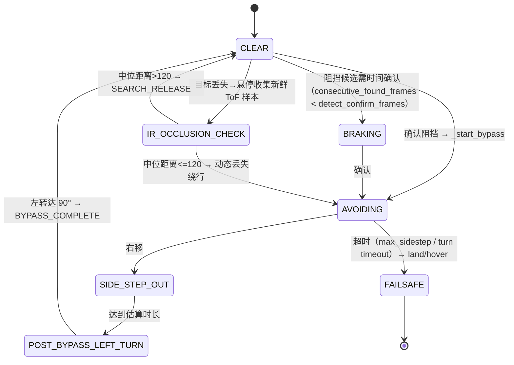

# 04 · 搜索避障与运动仲裁

> [返回总入口](README.md) · 上一篇：[03-视觉感知与目标跟随](03-视觉感知与目标跟随.md) · 下一篇：[05-安全机制与硬件边界](05-安全机制与硬件边界.md)
>
> 本文以 `ArbitrationEngine` 配方表为主事实源，说明三层有界搜索、前向 ToF 缓存、`MotionArbiter`、`ObstacleAvoidancePlanner` 的逐 tick 优先级与落地语义，以及中心丢失前探、异步 JSONL 日志和传感器盲区。

## 1. 仲裁配方表（优先级 1–6）

`ArbitrationEngine.arbitrate`（[control/kernel/arbitration.py:74](../control/kernel/arbitration.py#L74)）：

| 优先级 | 条件 | 所有者/动作 | 落地 |
|:---:|------|------|------|
| 1 | `paused` 或 `emergency` | 内核悬停，不调用任何 feature | `FollowTickOutcome(command=hover)`（[arbitration.py:78](../control/kernel/arbitration.py#L78)） |
| 2 | 安全层 `wants_landing`（电量/高度） | 内核循环处理 | 在 `_loop` 中落地（见 [02](02-系统架构与生命周期.md) §5） |
| — | 首次目标接受门：`_target_ever_acquired=False` | 丢失→直接搜索；有候选→FollowFeature 验证 | [arbitration.py:86](../control/kernel/arbitration.py#L86) |
| — | 水平边缘离场优先 | 整个重捕获留在 SEARCH | [arbitration.py:97](../control/kernel/arbitration.py#L97) |
| — | 明确过近后退优先 | 有界后退/停顿，高于 ToF 避障 | [arbitration.py:105](../control/kernel/arbitration.py#L105) |
| 3 | 目标丢失 + 障碍存在 | `ObstacleFeature.own`（OBSTACLE_FIRST） | [arbitration.py:109](../control/kernel/arbitration.py#L109) |
| 4 | 目标丢失 + 无障碍 + 搜索开启 | `SearchFeature.propose` | [arbitration.py:165](../control/kernel/arbitration.py#L165) |
| 5 | 目标丢失 + 无障碍 + 搜索关闭 | `SafetyFeature.lost_hover` | 同上 |
| 6 | 目标存在 | `FollowFeature.propose` → `ObstacleFeature.arbitrate`（`obstacle_priority=False`） | [arbitration.py:145](../control/kernel/arbitration.py#L145) |

要点：

- 每 tick **只选一个所有者**，未选中的 feature 冻结内部状态机与计时器（[arbitration.py:1](../control/kernel/arbitration.py#L1)）。
- `target_ever_acquired` 门：ReID 任务首次进入 FOLLOWING 前，前向 ToF 不参与运动决策（[arbitration.py:59](../control/kernel/arbitration.py#L59)）。
- 降级语义 `_finish`：`landing_kind="obstacle_failsafe"` → 立即落地（`OBSTACLE_FAILSAFE_LANDING`）；`"target_lost"` → 延迟落地（`lost_land=True`，先跑电量/高度检查）（[arbitration.py:177](../control/kernel/arbitration.py#L177)）。

## 2. 前向 ToF：唯一障碍输入

### 2.1 数据来源

- **RoboMaster TT 顶部扩展前向 ToF**，通过 `TelloDroneAdapter.get_front_distance_cm`（“EXT tof?”）读取。
- `DistanceOnlyObstacleDetector` 产生中性 CLEAR 观测，**不分析图像像素**（[vision/obstacle_detect.py:108](../vision/obstacle_detect.py#L108)）；真正障碍信号来自 `MotionArbiter._fuse_front_tof` 融合（[control/motion_arbiter.py:302](../control/motion_arbiter.py#L302)）。

### 2.2 后台采样与缓存

ReID 调试画面可显示 `目标人物`、`非目标人物`、`身份未确认` 和 `障碍物候选：类别`。这些标签只来自摄像头 YOLO/ReID，用于人工判断，不改变 `MotionArbiter` 的输入。实际飞行避障仍以顶部前向 ToF 为唯一安全输入；ToF 只能显示状态文字，不能伪造图像框。

### 2.3 视觉标签与飞控隔离

`FrontToFMonitor`（[drone/front_tof.py:23](../drone/front_tof.py#L23)）：

- 起飞前 `prepare()` 做一次 `_poll_once` 校验，失败**禁止起飞**（fail-closed，[front_tof.py:59](../drone/front_tof.py#L59)）。
- 起飞后 `start()` 启动 daemon 线程每 `front_tof_poll_interval_seconds`（当前 0.2 s）轮询（[front_tof.py:69](../drone/front_tof.py#L69)）。
- 控制循环只调用非阻塞 `snapshot()`（[front_tof.py:87](../drone/front_tof.py#L87)），带 `age_seconds/sequence/status`。
- 新鲜度：`age > front_tof_max_age_seconds`（当前 0.8 s）→ 标记 `stale`（[front_tof.py:93](../drone/front_tof.py#L93)）。
- 状态机：`not_ready` → `valid` / `out_of_range` / `error` / `stale`。
- `_poll_once` 对非法距离（`<=0` 或 `>120`）抛错（[front_tof.py:120](../drone/front_tof.py#L120)）。

### 2.4 BLOCKED 判定

`_fuse_front_tof`（[control/motion_arbiter.py:302](../control/motion_arbiter.py#L302)）：

- `front_tof_enabled`（当前 `true`，[config.yaml:90](../config.yaml#L90)）为假时直接返回视觉观测。
- `snapshot.status not in {valid, out_of_range}` → 抛 `RuntimeError`（转为 FAILSAFE）。
- `distance_cm <= front_tof_blocked_distance_cm`（当前 60 cm）→ 置 `found=True, state=BLOCKED, confidence=1.0`，`consecutive_blocked` 参与确认。

## 3. `MotionArbiter`（统一避障管线）

[control/motion_arbiter.py:29](../control/motion_arbiter.py#L29)

`decide(desired_command, frame, context, obstacle_priority=False)`（[motion_arbiter.py:115](../control/motion_arbiter.py#L115)）：

- **探测节流**：`detect_every_n_frames`（当前 1）帧内复用上次观测；复用时推进 `consecutive_found_frames`（[motion_arbiter.py:150](../control/motion_arbiter.py#L150)）。
- **障碍优先**：`obstacle_priority=True` 用于目标丢失场景，即使期望指令全零也允许规划器主动绕行。
- **中心丢失前探**（见 §6）。
- **异常处理**：避障管线异常 → `state=UNKNOWN`，决策 `FAILSAFE`；连续 `lost_tof_failures >= lost_tof_failure_limit`（5）→ 要求落地（[motion_arbiter.py:223](../control/motion_arbiter.py#L223)）。失败观测不缓存（置 `last_observation=None`），避免稀释后续帧。
- 日志：`_record` 通过 `_JsonlEventWriter` 异步写（见 §7）。

## 4. `ObstacleAvoidancePlanner`（确定性横向避障）

[control/obstacle_avoidance.py:47](../control/obstacle_avoidance.py#L47)

`plan(...)`（[obstacle_avoidance.py:179](../control/obstacle_avoidance.py#L179)）状态机：



### 4.1 普通 BLOCKED 绕行

- **BRAKING**：`consecutive_found_frames < detect_confirm_frames`（当前 3）时只刹停不绕行（[obstacle_avoidance.py:210](../control/obstacle_avoidance.py#L210)）。
- **SIDE_STEP_OUT**：固定向 `bypass_lateral_direction`（当前 right）以 `avoidance_lateral_speed`（当前 20）移动；时长 `_sidestep_duration_seconds = bypass_lateral_distance_cm / speed`（100/20 = 5 s）（[obstacle_avoidance.py:503](../control/obstacle_avoidance.py#L503)）。
  - **1 m 是速度—时间估算**，不是里程计实测；受电量、风、地效影响（[README.md:195](../README.md#L195)）。
  - 超过 `max_sidestep_seconds`（当前 10 s）→ FAILSAFE（[obstacle_avoidance.py:398](../control/obstacle_avoidance.py#L398)）。
- **POST_BYPASS_LEFT_TURN**：以 `post_bypass_turn_speed`（当前 12）左转，用 yaw 遥测累计进度直到 `post_bypass_turn_degrees`（90°）（[obstacle_avoidance.py:406](../control/obstacle_avoidance.py#L406)）；超过 `post_bypass_turn_timeout_seconds`（15 s）→ FAILSAFE。
- **绕行全程绝不前进**（横向/偏航仅保留 `up_down`）。
- **FAILSAFE**：`timeout_action`（当前 land）→ `requires_landing=True`，内核立即落地（[obstacle_avoidance.py:480](../control/obstacle_avoidance.py#L480)）。

### 4.2 恢复确认

`_plan_clear`：AVOIDING/RECOVERING/BRAKING 后需 `max(recovery_clear_frames, clear_confirm_frames)`（10/5）连续 CLEAR 帧才释放 FOLLOW（[obstacle_avoidance.py:311](../control/obstacle_avoidance.py#L311)）。

## 5. `TargetSearchController`（三层有界搜索）

[control/target_search.py:21](../control/target_search.py#L21)

### 5.1 状态流

```text
IDLE → LOST_HOLD(1s) → [CLOSE_BACKOFF → CLOSE_BACKOFF_PAUSE]×≤2
     → SEARCH_LAST_DIRECTION(±25, 2s)
     → MOVE_TO_LAYER → LAYER_SCAN_FULL(±30, 360°) ×3 层（当前/上/下，20cm 步进）
     → RETURN_TO_BASE → SEARCH_COMPLETE_LANDING
```

实现要点：

- **hold**：`hold_seconds=1.0` 悬停（[target_search.py:193](../control/target_search.py#L193)）。
- **过近后退**：`close_recovery_enabled`，`close_area_ratio=0.32`、`close_very_area_ratio=0.37`；`_looks_too_close`（面积增长>8% / 触边 / 此前已后退）（[target_search.py:367](../control/target_search.py#L367)）。以 `-close_backward_speed(35)` 后退 `close_pulse_seconds(1.5)`，停顿 `close_pause_seconds(0.5)`，最多 `close_max_attempts(2)` 次。
- **最后方向**：按最后水平方向以 `last_direction_yaw_speed(25)` 偏航 `last_direction_seconds(2.0)`（[target_search.py:233](../control/target_search.py#L233)）。
- **三层扫描**：`_LAYER_OFFSETS=(0, 1, -1)`；`MOVE_TO_LAYER` 垂直爬升/下降 `vertical_speed(20)`；`LAYER_SCAN_FULL` 用 yaw 遥测累计完整 360°（`full_rotation_degrees=360`），无遥测时回退到 `full_rotation_fallback_seconds=12.0`（[target_search.py:251](../control/target_search.py#L251)）；相邻层反向旋转（[target_search.py:321](../control/target_search.py#L321)）。
- **返回基准高度**：`RETURN_TO_BASE` 回到搜索起始高度后落地（`SEARCH_COMPLETE_LANDING`），**无总时间限制**（[target_search.py:295](../control/target_search.py#L295)）。
- **重新确认**：搜索中重新出现 fresh 目标需连续 `reacquire_frames(5)` 帧（`_reacquire_tracker`）才 `reset()` 回到跟随（[target_search.py:176](../control/target_search.py#L176)）。

### 5.2 两个高于避障的判定

- `close_recovery_has_priority()`（[target_search.py:99](../control/target_search.py#L99)）：仅过近后退优先于 ToF 避障。
- `horizontal_edge_exit_has_priority()`（[target_search.py:109](../control/target_search.py#L109)）：目标从左/右**水平边**离场时，整个重捕获留在搜索，不让前向 ToF 开始前探或绕行。判定要求框中心在边侧外 1/4（[target_search.py:398](../control/target_search.py#L398)）。

## 6. 中心丢失前探（CENTER_LOSS_ADVANCE）

当目标丢失前连续 `center_loss_history_frames`（3）帧目标框均未触碰左右边缘（[motion_arbiter.py:280](../control/motion_arbiter.py#L280)），判定为非横向离场：

- 以 `center_loss_forward_speed(25)` **直行前进**，直到前向 ToF 发现 `<=120 cm` 内任意实体（[motion_arbiter.py:167](../control/motion_arbiter.py#L167)）。
- 发现实体 → 置 `BLOCKED` 并 `immediate_lost_bypass=True` 启动绕行（[motion_arbiter.py:173](../control/motion_arbiter.py#L173)）。
- 未发现 → 保持 `CENTER_LOSS_ADVANCE`（[motion_arbiter.py:197](../control/motion_arbiter.py#L197)）。
- **ToF 只能判断实体距离，不能确认是不是目标人物**；读数超时/错误/过期时必须悬停而不是继续直行（[README.md:197](../README.md#L197)）。

## 7. 异步 JSONL 日志

`_JsonlEventWriter`（[control/motion_arbiter.py:455](../control/motion_arbiter.py#L455)）：

- daemon 线程 + 有界队列（256），`put_nowait` 满则 `dropped += 1`（[motion_arbiter.py:465](../control/motion_arbiter.py#L465)）。
- `close()` 发 `None` 哨兵并 join（[motion_arbiter.py:471](../control/motion_arbiter.py#L471)）。
- 文件：`logs/avoidance/<UTC 时间戳>-<session_id>.jsonl`（[motion_arbiter.py:389](../control/motion_arbiter.py#L389)）。
- `log_enabled=true`（[config.yaml:119](../config.yaml#L119)）时启用。
- **日志只用于诊断，不是飞控输入或可靠审计日志**：丢事件不阻塞控制循环。
- 过滤：`observation.found` 或 `decision.state not in {CLEAR, RECOVERING}` 时每 `log_every_n_frames`（2）帧记录；否则跳过（[motion_arbiter.py:364](../control/motion_arbiter.py#L364)）。
- 载荷含 `schema_version: 1`（[motion_arbiter.py:369](../control/motion_arbiter.py#L369)）——旧 avoidance JSONL 不代表当前 distance-only schema。

## 8. 已知限制与实现风险

- **stale ToF 序列累计风险**：`_fuse_front_tof` 抛错时按 `_latest_front_sequence != _last_failed_front_sequence` 计数（[motion_arbiter.py:225](../control/motion_arbiter.py#L225)）；若同一 sequence 反复出现（无新采样），`_lost_tof_failures` 不会持续累计到落地阈值。
- **sidestep 最大时间检查顺序**：`SIDE_STEP_OUT` 中先检查“达到估算时长”再检查 `max_sidestep_seconds`（[obstacle_avoidance.py:375](../control/obstacle_avoidance.py#L375)）；极端情况下估算时长 ≥ 上限时直接进 FAILSAFE。
- **`front_tof_clear_distance_cm`（70）当前未参与主路径**：`ObstacleAvoidancePlanner` 用 `clearance_distance_cm` 初始化但它只作 `front_tof_clear_distance_cm` 读取，当前 `_fuse_front_tof`/`plan` 未消费该值。
- **若干 legacy 参数未消费**：`avoidance_yaw_speed`、`max_avoidance_seconds`、`bypass_forward_*`、`lost_forward_margin_cm`、`forward_pulse_seconds`、`forward_check_seconds` 等被接受但 `del`（[obstacle_avoidance.py:82](../control/obstacle_avoidance.py#L82)）。
- **检测器节流**：`detect_every_n_frames` 默认 1（每帧检测），改大会延迟障碍发现。

## 9. 传感器盲区

顶部前向 ToF 覆盖**单个前向扇区**，不能保护后方、侧方、上方、下方；启用真机避障前必须人工确认这些方向净空，并随时准备按 `e` 急停（[README.md:195](../README.md#L195)）。`reid-demo` 起飞爬升与首次搜索明确绕过前向 ToF 避障（[README.md:165](../README.md#L165)）。

## 10. 代码依据

- 仲裁：`control/kernel/arbitration.py::ArbitrationEngine.arbitrate`（[control/kernel/arbitration.py:74](../control/kernel/arbitration.py#L74)）
- 前向 ToF：`drone/front_tof.py::FrontToFMonitor`（[drone/front_tof.py:23](../drone/front_tof.py#L23)）
- 统一管线：`control/motion_arbiter.py::MotionArbiter`（[control/motion_arbiter.py:29](../control/motion_arbiter.py#L29)）
- 规划器：`control/obstacle_avoidance.py::ObstacleAvoidancePlanner`（[control/obstacle_avoidance.py:47](../control/obstacle_avoidance.py#L47)）
- 搜索：`control/target_search.py::TargetSearchController`（[control/target_search.py:21](../control/target_search.py#L21)）
- 障碍数据契约：`vision/obstacle_detect.py`（[vision/obstacle_detect.py:51](../vision/obstacle_detect.py#L51)）

## 11. 不保证的能力

- 不保证 1 m 侧移的物理距离；不保证 ToF 能区分障碍物与目标人物。
- 不保证搜索能在真实空间中找回目标；搜索无总时间限制，一轮失败即落地。
- 不保证避障对后方/侧方/上方/下方有效；不保证日志完整（有界队列可丢弃）。
- 不保证在线决策依赖网络大模型——它是纯确定性算法；但也不保证无需人工看护。
