# 07 · Electron 桌面端架构与安全边界

> [返回总入口](README.md) · 上一篇：[06-配置测试与源码索引](06-配置测试与源码索引.md) · 操作手册：[桌面端真机操作指导书](桌面端真机操作指导书.md)
>
> 本文说明统一运行时后的桌面端进程边界、控制链路、安全机制、构建发布流程和已知风险。桌面端面向真机操作员，复用 CLI 自动任务内核，但不替代 CLI 的模拟、算法自测和 Console 工具。

## 1. 能力边界

| 能力 | CLI `FollowSession` | Electron 桌面端 |
|------|---------------------|-----------------|
| 真机连接、视频、起降 | 是 | 是 |
| 手动四通道 RC | 是（OpenCV 按键） | 是（React 控制台） |
| Fake 适配器 | 是 | 否 |
| 人物 ReID / 建档 | 是 | 是；含地面叠加预览与连续确认 |
| 普通、侧向、前向自动跟随 | 是 | 是 |
| 目标丢失搜索 | 是 | 是（共享 `FollowSession`） |
| 自动绕障与运动仲裁 | 普通模式可选 | 普通模式可选；手动路径只阻止危险方向 |
| `config.yaml` | 读取 | 读取共享安全、视觉与任务配置 |

两个入口可以复用真机适配器代码，但不共享会话、状态或 RC 仲裁。任何时候只能有一个进程控制同一架无人机；Electron 的单实例锁不能阻止 CLI 或第三方 Tello 程序同时运行。

## 2. 进程与信任边界

```mermaid
flowchart LR
    UI[React renderer] -->|window.phantomFilmer| PRELOAD[context-isolated preload]
    PRELOAD -->|白名单 IPC| MAIN[Electron main]
    MAIN -->|X-Phantom-Token| HTTP[127.0.0.1 随机端口]
    HTTP --> MANAGER[MissionManager typed commands]
    MANAGER --> SERVICE[Python DroneWebService]
    SERVICE --> ADAPTER[RealTelloAdapter]
    ADAPTER --> TELLO[TelloDroneAdapter / djitellopy]
    TELLO -->|UDP + 视频流| AIRCRAFT[RoboMaster TT]
```

- renderer 不获得 Node.js、文件系统、sidecar 端口或主会话令牌；preload 只公开类型化飞行 API（[desktop/src/preload/index.ts](../desktop/src/preload/index.ts)）。
- Electron main 每次启动生成 32 字节随机令牌，启动 sidecar 后从 stdout 的 ready JSON 取得随机端口（[desktop/src/main/sidecar.ts:49](../desktop/src/main/sidecar.ts#L49)）。
- Python HTTP 服务只绑定 `127.0.0.1`，普通 API 使用常量时间 HMAC 比较验证 `X-Phantom-Token`（[web_api/server.py:27](../web_api/server.py#L27)）。
- 视频地址使用 30 秒、消费一次即失效的独立令牌，避免把主会话令牌放入 URL（[web_api/server.py:607](../web_api/server.py#L607)）。
- BrowserWindow 开启 `contextIsolation`、sandbox、`webSecurity`，关闭 `nodeIntegration`；外部导航、webview、权限请求和非回环网络均被拒绝，并设置 CSP（[desktop/src/main/index.ts:24](../desktop/src/main/index.ts#L24)）。

这些措施用于缩小本地桌面应用的攻击面，不等价于操作系统级隔离，也不能保护被控制的无人机 Wi-Fi 或 SDK UDP 链路。

## 3. 生命周期与接口

Electron main 启动 `SidecarManager`，sidecar 在收到显式 `device.connect` 命令前不会连接无人机或请求视频。主要调用链如下：

| 操作 | HTTP 路径 | sidecar 行为 |
|------|-----------|--------------|
| 健康检查 | `GET /api/v1/health` | 验证进程、认证链路与 API 版本 |
| 能力 / 快照 / 事件 | `GET /api/v1/capabilities`、`runtime/snapshot`、`runtime/events?since=` | 能力协商、权威状态与断线补读 |
| 连接 / 状态 | `POST /api/v1/commands`：`device.connect` / `device.status.refresh` | SDK/视频/ToF 初始化与遥测刷新 |
| 起飞 / 悬停 / 降落 | `POST /api/v1/commands`：`flight.*` | 五项预检、清零与正常降落 |
| RC 租约 | `POST /api/v1/rc/lease` | 空中状态下获取 1 秒独占控制权并先悬停 |
| RC / 释放 | `POST /api/v1/rc`、`rc/release` | 校验租约、序号、时间戳、安全门；释放时清零 |
| 停止 / 紧急降落 | `POST /api/v1/commands`：`device.stop` / `flight.emergency_land` | 空中先降落，再关闭会话 |
| 地面预览 | `POST /api/v1/commands`：`preview.start` / `preview.stop` | 加载指定档案，在 MJPEG 上执行 ReID/朝向叠加并报告稳定确认 |
| 自动任务 | `POST /api/v1/commands`：`mission.*` | 启停/急停、暂停、模式选择和检测器移交 |
| 安全退出 | `POST /api/sidecar/shutdown` | 停止看门狗、降落/断开并退出进程 |

HTTP handler 会把连接、状态、起降、悬停、停止和急停请求转换为 `app/runtime/commands.py` 的强类型命令，再通过 `MissionManager.execute()` 串行执行。每条命令发布单调序号事件和同序号 `RuntimeSnapshot`；客户端可按 `since` 补读有限历史，历史缺口返回 `resetRequired=true` 并要求重取快照。旧 `/api/...` 响应格式目前保留兼容，但 Electron main 已只使用 v1。

`DroneWebService` 使用 `RLock` 保护适配器和遥测状态。前向 ToF 独立轮询；RC 看门狗每 0.1 秒检查一次，非零命令超过 0.4 秒未刷新就清零；手动飞行遥测线程按配置刷新电量与底部 ToF并执行安全降落。renderer 按键按下期间每 180 ms 重发命令，松键、指针取消或窗口失焦会主动悬停。

renderer 使用单屏控制台：左侧“任务与人物”用于档案选择和建档，右侧“飞行控制”提供
模式按钮、视频、遥测、停止/急停，以及手动接管后的控制板。档案和任务入口仍受
capability、权威 allowed actions、预检与模型资产状态约束；调试预览接口保留给后端诊断，
不再是自动任务的起飞前置条件。

`useRuntimeFeed` 在后端 ready 后加载 capability 与快照，并每 750 ms 按事件序号增量补读；若服务端返回 `resetRequired`，立即丢弃推断状态并重取权威快照。该轮询用于操作界面状态同步，不替代 RC 看门狗或飞行安全线程。

自动任务的底层会话支持 `OperatorCommandChannel`：GUI 使用语义命令选择手动、普通、侧向或前向模式，并可发送暂停、悬停、短时手动方向、停止和急停；`FollowSession` 在无 OpenCV 窗口时仍持续执行电量、高度、视频和安全检查。邮箱有界，停止/急停会清除排队中的旧运动指令；急停在下一次帧读取或推理前处理。起飞稳定、验高与爬升阶段只消费停止/急停，提前选择的模式保留到 `CONTROL_READY`。

sidecar 启动自动任务时让 `CameraStream` 附着于已有视频流：任务结束只结束自身读取状态，不关闭由桌面服务持有的 MJPEG 流。CLI 保持原有的独占启停行为。

sidecar 已实现 `mission.start`、`mission.stop`、`mission.emergency_stop`、`mission.control_mode.select` 和 `mission.pause.toggle`。任务从地面异步启动并复用 CLI 的 `MissionFactory`、ReID、搜索、避障与安全内核；同一期间独立手动起飞/RC 被互斥拒绝。切到手动接管后，桌面 RC 继续使用 v1 租约，但在后端转换为单轴语义命令交给 `ManualControlController`，不会绕过任务内核直接写 SDK。

人物档案保存在 Electron `userData/reid_profiles`。renderer 只能请求系统文件选择器，所选路径由 Electron main 发送给认证 sidecar；建档只允许在无人机断开时执行。capability 始终列出已实现任务，并通过 `missionReadiness.available/missingAssets` 单独报告 YOLO、OSNet 和 JointBDOE 权重是否就绪；缺少资产时 GUI 禁止预览和任务。预览必须使用任务选择的档案，连续命中达到 `reid_lock_stable_frames` 后才开放起飞，超过 `desktop_preview_max_age_seconds` 无新帧即失效。启动时同一检测器在推理锁边界内移交给 `FollowSession`。

## 4. 桌面端安全门

桌面端从 `config.yaml` 读取共享安全阈值；`web_api.server` 只保留传输层默认时限：

| 门槛 | 当前值 | 生效位置 |
|------|--------|----------|
| 起飞最低电量 | 20% | 五项预检 |
| 飞行中低电降落 | 5% | 手动线程与自动任务分别收敛到降落 |
| 最大安全高度 | 220 cm | 手动线程与自动任务分别收敛到降落 |
| RC 单通道限幅 | 35 | 每次手动 RC |
| RC 控制权租约 | 1.0 s 滑动续期 | 单一 `leaseId`；每包 sequence 严格递增，`issuedAt` 时钟偏差 ≤5 s |
| RC 指令看门狗 | 0.4 s | 即使租约尚未过期，非零指令未刷新也清零并撤销租约 |
| 前进停止距离 | 60 cm | 过近、无效或超过配置新鲜度时拒绝正向 RC |
| 最低继续下降高度 | 40 cm | 不高于该值时拒绝下降 |
| 最高继续上升高度 | 200 cm | 不低于该值时拒绝上升 |
| 手动遥测周期 / 新鲜度 | 0.5 s / 2.0 s | 连续失败降落；高度无效或过期时拒绝升降 |
| 地面确认新鲜度 | 2.0 s | 超时撤销自动任务起飞权 |

起飞必须同时满足 SDK、有效视频、电量、底部高度、前向 ToF 五项预检。起飞、正常降落和紧急降落还需要 renderer 的 4 秒二次确认。退出时若最后状态为空中，主进程要求先降落；安全清理失败时必须经过第二次明确风险确认才能强制退出。

## 5. 与 CLI 安全模型的差异

以下差异仍是当前实现边界：

1. 独立手动飞行不进入 `KernelSession`；它使用 sidecar 的租约、方向门、看门狗和遥测降落线程。自动任务才构造完整 `SafetyManager` / `KernelSession` / `ArbitrationEngine`。
2. 前向 ToF 在手动路径只禁止前进，不会自动后退或绕障；普通自动模式可选避障，侧向/前向模式仍要求全向净空。
3. 后、侧、上、下方向没有障碍感知；底部 ToF 只提供离地高度，不是下方碰撞识别器。
4. GUI 不提供 Fake、dry-run、算法自测、连接测试或自然语言 Console，这些仍由 CLI 承担。

## 6. 崩溃与退出语义

`SidecarManager` 保存最近一次成功 HTTP 响应中的 `airborne`。起飞请求一旦发出，主进程会先保守标记“可能在空中”；即使 sidecar 在返回响应前退出，也会锁定所有控制并禁止自动重启，直到明确收到降落或停止结果。现有 E2E 同时覆盖“已收到空中状态后崩溃”和“起飞响应前崩溃”两条路径（[desktop/e2e/app.spec.ts:39](../desktop/e2e/app.spec.ts#L39)）。

该保守状态只能表达“不能证明仍在地面”，不能证明真实空中/落地状态。发生任何起飞阶段后端中断时，仍必须以目视真机状态为准，不能只依赖界面。

强制终止 sidecar 不能保证飞控已收到悬停或降落命令；飞行审计也只能证明本进程尝试调用 SDK，不能证明物理动作完成。

## 7. 构建、测试与交付

CI 的 `verify` job 依次执行 Python pytest、TypeScript typecheck、Vitest、Electron 生产构建和使用假 sidecar 的 Playwright E2E；验证通过后才构建 Linux x64 AppImage、macOS x64/arm64 DMG，最后构建 Windows x64 NSIS（[desktop-build.yml](../.github/workflows/desktop-build.yml)）。PyInstaller 生成包含 `config.yaml`、YOLO/OSNet/JointBDOE 权重、JointBDOE 推理源码及完整视觉运行时的 onedir sidecar，并执行 ready 握手、认证关闭和三套模型真实加载冒烟；electron-builder 再把它放入 `extraResources/sidecar`。

当前交付边界：

- E2E 使用 `PHANTOMFILMER_SIDECAR_PATH` 指向测试脚本；打包后的 PyInstaller sidecar 会验证启动、ready 握手、安全退出及三套视觉模型加载，但不覆盖摄像头推理和飞行任务。
- CI 没有安装产物启动测试，也没有逐平台卸载、权限提示或真机冒烟测试。
- macOS 构建显式关闭自动签名发现，`hardenedRuntime` 与 `gatekeeperAssess` 均为 false；首轮产物未签名、未公证。
- SHA-256 文件用于检测下载损坏或产物替换；只有通过可信渠道取得校验文件时才有来源保证。

因此，CI 全绿只证明源码级软件链路和假 sidecar 集成通过，不证明安装包、真实 Wi-Fi、摄像头、ToF 或真机动力学安全。

## 8. 当前已知问题与维护优先级

1. **真机预览/任务移交未验收**：需要真实人物、真实权重和无人机视频验证识别率、朝向、帧率与检测器移交期间的连续性。
2. **安装产物未完整冒烟**：sidecar 已验证启动、ready 握手、安全退出和模型加载；仍需在每个平台启动安装后的 GUI，验证真实视频推理、权限提示与完整退出流程。
3. **全向障碍感知缺失**：侧向/前向模式和手动后/侧运动仍依赖现场净空。
4. **macOS 未签名/未公证**：发布前补签名、hardened runtime、公证与 Gatekeeper 验证。

## 9. 代码索引

- Electron 生命周期与安全退出：[desktop/src/main/index.ts](../desktop/src/main/index.ts)
- sidecar 启动、认证请求与崩溃状态：[desktop/src/main/sidecar.ts](../desktop/src/main/sidecar.ts)
- renderer 白名单：[desktop/src/preload/index.ts](../desktop/src/preload/index.ts)
- 工作区编排与二次确认：[desktop/src/renderer/src/App.tsx](../desktop/src/renderer/src/App.tsx)
- 渲染层组件（左栏 tab/态势条/模式行/视频/遥测/手动 HUD/事件时间线）：[desktop/src/renderer/src/components/](../desktop/src/renderer/src/components/)
- capability、快照与事件同步：[desktop/src/renderer/src/app/useRuntimeFeed.ts](../desktop/src/renderer/src/app/useRuntimeFeed.ts)
- 飞行状态与事件中文标签映射：[desktop/src/renderer/src/app/flightStates.ts](../desktop/src/renderer/src/app/flightStates.ts)、[desktop/src/renderer/src/app/eventLabels.ts](../desktop/src/renderer/src/app/eventLabels.ts)
- sidecar 心跳探活（纯逻辑，可单测）：[desktop/src/main/heartbeat.ts](../desktop/src/main/heartbeat.ts)
- 本地 HTTP 服务与安全门：[web_api/server.py](../web_api/server.py)
- 真机包装与审计目录：[web_api/tello_adapter.py](../web_api/tello_adapter.py)
- sidecar 打包：[scripts/build_sidecar.py](../scripts/build_sidecar.py)、[sidecar/phantomfilmer_sidecar.spec](../sidecar/phantomfilmer_sidecar.spec)
- Electron 打包配置：[desktop/package.json](../desktop/package.json)
- CI：[.github/workflows/desktop-build.yml](../.github/workflows/desktop-build.yml)

## 11. 2026-08 界面与通信更新（对上文第 3-5 节的增量）

- **渲染层结构**：`App.tsx` 收敛为纯编排，界面拆为 `components/` 下八个组件；左栏改为
  “人物档案 / 起飞准备 / 运行事件”三 tab（非激活面板保持挂载，建档中途切换不丢状态），
  起飞按钮常驻 tab 外；飞行状态、暂停、遥测陈旧与安全告警合并为常驻态势条；手动控制板
  改为视频内半透明 HUD 叠加；事件时间线移入 tab。
- **布局契约**：`html/body` 锁定视口高度并隐藏页面滚动，设计底线 1040×760（与窗口
  minWidth/minHeight 一致），1366/1100 两档断点 + `clamp()` 自适应；视频 `object-fit:
  cover` 铺满视频区（保持比例、上下轻微裁切，不出现左右黑边）。e2e 在两个尺寸断言
  `scrollWidth/scrollHeight` 不超过可视区。
- **通信与运行时保障增量**：主进程 5 秒心跳探测 sidecar（连续 3 次失败且无在途请求判定
  挂起，空中状态禁止重启；逻辑在 `heartbeat.ts`，含 5 个单测）；视频会话中断后 1s 起步
  退避自动重连 3 次，并提供手动“重建视频会话”；键盘 `Q`/`E` 与按钮一致需 4 秒双击确认；
  模式/停止/急停/暂停按钮使能改由快照 `allowedActions` 门控。
- **新增操作面**：人物跟拍任务由界面固定传入 `mission.start`；
  暂停/继续（按钮 + `P` 键）；两步建档（选照片→确认）；顶栏日志目录与断开真机入口；
  手动 HUD 内键盘控制开关；输入框聚焦时飞行键失效。
- **已知取舍**：`takeoff`/`land`/`selectControlMode`/预览 API 在 preload 层保留但界面
  未使用（预览为诊断预留）；视频 cover 模式裁切画面上下边缘。

## 10. 不保证的能力

- 不保证自动化通过即可证明真实人物识别、朝向估计、避障动力学或物理降落成功。
- 不保证 renderer 显示状态与无人机物理状态强一致，尤其是网络、进程或起飞响应异常时。
- 不保证 unsigned 安装包在所有目标系统上可直接运行。
- 不保证自动化测试结果可替代逐平台安装验收和真机验收。
