# 07 · Electron 桌面端架构与安全边界

> [返回总入口](README.md) · 上一篇：[06-配置测试与源码索引](06-配置测试与源码索引.md) · 操作手册：[桌面端真机操作指导书](桌面端真机操作指导书.md)
>
> 本文以 `be73305`（WebUI 迁移至 Electron）为基线，说明桌面端的进程边界、控制链路、安全机制、构建发布流程和当前已知风险。桌面端是独立的真机手动控制运行时，不是 CLI 自动跟随界面的替代实现。

## 1. 能力边界

| 能力 | CLI `FollowSession` | Electron 桌面端 |
|------|---------------------|-----------------|
| 真机连接、视频、起降 | 是 | 是 |
| 手动四通道 RC | 是（OpenCV 按键） | 是（React 控制台） |
| Fake 适配器 | 是 | 否 |
| 人物 ReID / 建档 | 是 | 否 |
| 普通、侧向、前向自动跟随 | 是 | 否 |
| 目标丢失搜索 | 是 | 否 |
| 自动绕障与运动仲裁 | 普通模式可选 | 否；只阻止危险方向 |
| `config.yaml` | 读取 | 不读取，使用 sidecar 常量 |

两个入口可以复用真机适配器代码，但不共享会话、状态或 RC 仲裁。任何时候只能有一个进程控制同一架无人机；Electron 的单实例锁不能阻止 CLI 或第三方 Tello 程序同时运行。

## 2. 进程与信任边界

```mermaid
flowchart LR
    UI[React renderer] -->|window.phantomFilmer| PRELOAD[context-isolated preload]
    PRELOAD -->|白名单 IPC| MAIN[Electron main]
    MAIN -->|X-Phantom-Token| HTTP[127.0.0.1 随机端口]
    HTTP --> MANAGER[MissionManager typed commands]
    MANAGER --> SERVICE[Python DroneWebService]
    SERVICE --> ADAPTER[RealTelloAdapter]
    ADAPTER --> TELLO[TelloDroneAdapter / djitellopy]
    TELLO -->|UDP + 视频流| AIRCRAFT[RoboMaster TT]
```

- renderer 不获得 Node.js、文件系统、sidecar 端口或主会话令牌；preload 只公开类型化飞行 API（[desktop/src/preload/index.ts](../desktop/src/preload/index.ts)）。
- Electron main 每次启动生成 32 字节随机令牌，启动 sidecar 后从 stdout 的 ready JSON 取得随机端口（[desktop/src/main/sidecar.ts:49](../desktop/src/main/sidecar.ts#L49)）。
- Python HTTP 服务只绑定 `127.0.0.1`，普通 API 使用常量时间 HMAC 比较验证 `X-Phantom-Token`（[web_api/server.py:27](../web_api/server.py#L27)）。
- 视频地址使用 30 秒、消费一次即失效的独立令牌，避免把主会话令牌放入 URL（[web_api/server.py:607](../web_api/server.py#L607)）。
- BrowserWindow 开启 `contextIsolation`、sandbox、`webSecurity`，关闭 `nodeIntegration`；外部导航、webview、权限请求和非回环网络均被拒绝，并设置 CSP（[desktop/src/main/index.ts:24](../desktop/src/main/index.ts#L24)）。

这些措施用于缩小本地桌面应用的攻击面，不等价于操作系统级隔离，也不能保护被控制的无人机 Wi-Fi 或 SDK UDP 链路。

## 3. 生命周期与接口

Electron main 启动 `SidecarManager`，sidecar 在收到显式 `device.connect` 命令前不会连接无人机或请求视频。主要调用链如下：

| 操作 | HTTP 路径 | sidecar 行为 |
|------|-----------|--------------|
| 健康检查 | `GET /api/v1/health` | 验证进程、认证链路与 API 版本 |
| 能力 / 快照 / 事件 | `GET /api/v1/capabilities`、`runtime/snapshot`、`runtime/events?since=` | 能力协商、权威状态与断线补读 |
| 连接 / 状态 | `POST /api/v1/commands`：`device.connect` / `device.status.refresh` | SDK/视频/ToF 初始化与遥测刷新 |
| 起飞 / 悬停 / 降落 | `POST /api/v1/commands`：`flight.*` | 五项预检、清零与正常降落 |
| RC 租约 | `POST /api/v1/rc/lease` | 空中状态下获取 1 秒独占控制权并先悬停 |
| RC / 释放 | `POST /api/v1/rc`、`rc/release` | 校验租约、序号、时间戳、安全门；释放时清零 |
| 停止 / 紧急降落 | `POST /api/v1/commands`：`device.stop` / `flight.emergency_land` | 空中先降落，再关闭会话 |
| 安全退出 | `POST /api/sidecar/shutdown` | 停止看门狗、降落/断开并退出进程 |

HTTP handler 会把连接、状态、起降、悬停、停止和急停请求转换为 `app/runtime/commands.py` 的强类型命令，再通过 `MissionManager.execute()` 串行执行。每条命令发布单调序号事件和同序号 `RuntimeSnapshot`；客户端可按 `since` 补读有限历史，历史缺口返回 `resetRequired=true` 并要求重取快照。旧 `/api/...` 响应格式目前保留兼容，但 Electron main 已只使用 v1。

`DroneWebService` 使用 `RLock` 保护适配器和遥测状态。前向 ToF 由独立线程每 0.2 秒轮询；RC 看门狗每 0.1 秒检查一次，非零命令超过 0.4 秒未刷新就清零。renderer 按键按下期间每 180 ms 重发命令，松键、指针取消或窗口失焦会主动悬停。

## 4. 桌面端安全门

桌面端阈值定义在 [web_api/server.py:27](../web_api/server.py#L27)，当前不读取 `config.yaml`：

| 门槛 | 当前值 | 生效位置 |
|------|--------|----------|
| 起飞最低电量 | 20% | 仅起飞前五项预检 |
| RC 单通道限幅 | 35 | 每次手动 RC |
| RC 控制权租约 | 1.0 s 滑动续期 | 单一 `leaseId`；每包 sequence 严格递增，`issuedAt` 时钟偏差 ≤5 s |
| RC 指令看门狗 | 0.4 s | 即使租约尚未过期，非零指令未刷新也清零并撤销租约 |
| 前进停止距离 | 60 cm | 过近、无效或超过 1.2 s 未更新时拒绝正向 RC |
| 最低继续下降高度 | 40 cm | 已有高度缓存且不高于该值时拒绝下降 |
| 最高继续上升高度 | 200 cm | 已有高度缓存且不低于该值时拒绝上升 |

起飞必须同时满足 SDK、有效视频、电量、底部高度、前向 ToF 五项预检。起飞、正常降落和紧急降落还需要 renderer 的 4 秒二次确认。退出时若最后状态为空中，主进程要求先降落；安全清理失败时必须经过第二次明确风险确认才能强制退出。

## 5. 与 CLI 安全模型的差异

以下差异是当前实现边界，不应由界面文案推断为“等价安全能力”：

1. 桌面端不构造 `SafetyManager`、`KernelSession` 或 `ArbitrationEngine`，也不执行自动目标丢失搜索、低电量落地状态机和最大高度强制降落。
2. 电量与底部高度由 renderer 的 1 秒状态轮询间接刷新；sidecar 没有独立的飞行中低电量监视和高度新鲜度时间戳。
3. 升降门使用最近一次 `_height` 缓存。若高度为 `None`，当前实现不会阻止升降；它只在已有缓存越界时拒绝对应方向。
4. 前向 ToF 有独立后台监视，但只禁止继续前进，不会自动后退、侧移、绕障或降落；后、侧、上、下方向没有障碍传感保护。
5. sidecar 的常量与 CLI YAML 是两套配置源。修改一处不会同步另一处，阈值变更必须显式双向核对并补测试。

## 6. 崩溃与退出语义

`SidecarManager` 保存最近一次成功 HTTP 响应中的 `airborne`。起飞请求一旦发出，主进程会先保守标记“可能在空中”；即使 sidecar 在返回响应前退出，也会锁定所有控制并禁止自动重启，直到明确收到降落或停止结果。现有 E2E 同时覆盖“已收到空中状态后崩溃”和“起飞响应前崩溃”两条路径（[desktop/e2e/app.spec.ts:39](../desktop/e2e/app.spec.ts#L39)）。

仍存在一个遥测窗口：物理起飞发生在 Python 响应返回之前，而 Electron main 只在 `takeoff()` 请求成功后更新 `lastStatus`。如果 sidecar 在物理起飞后、HTTP 响应前崩溃，main 可能仍把最后状态视为地面并允许重启。发生任何起飞阶段后端中断时，都必须以目视真机状态为准，不能只依赖“允许重启”按钮。

强制终止 sidecar 不能保证飞控已收到悬停或降落命令；飞行审计也只能证明本进程尝试调用 SDK，不能证明物理动作完成。

## 7. 构建、测试与交付

CI 的 `verify` job 依次执行 Python pytest、TypeScript typecheck、Vitest、Electron 生产构建和使用假 sidecar 的 Playwright E2E；验证通过后才构建 Linux x64 AppImage、macOS x64/arm64 DMG，最后构建 Windows x64 NSIS（[desktop-build.yml](../.github/workflows/desktop-build.yml)）。PyInstaller 先生成 onedir sidecar，electron-builder 再把它放入 `extraResources/sidecar`。

当前交付边界：

- E2E 使用 `PHANTOMFILMER_SIDECAR_PATH` 指向测试脚本，不会启动打包后的 PyInstaller sidecar。
- CI 没有安装产物启动测试，也没有逐平台卸载、权限提示或真机冒烟测试。
- macOS 构建显式关闭自动签名发现，`hardenedRuntime` 与 `gatekeeperAssess` 均为 false；首轮产物未签名、未公证。
- SHA-256 文件用于检测下载损坏或产物替换；只有通过可信渠道取得校验文件时才有来源保证。

因此，CI 全绿只证明源码级软件链路和假 sidecar 集成通过，不证明安装包、真实 Wi-Fi、摄像头、ToF 或真机动力学安全。

## 8. 当前已知问题与维护优先级

1. **起飞响应前崩溃竞态**：优先让 main 在发起起飞时进入保守的“可能在空中”状态，直到明确收到地面结果。
2. **飞行中低电量/高度监视缺失**：将关键遥测监视放入 sidecar 独立线程，并定义读取失败和超时的收敛动作。
3. **高度缓存无新鲜度门**：为底部高度增加采样时间戳；无效或过期时至少拒绝升降。
4. **双配置源漂移**：集中定义或生成 CLI/sidecar 共享安全阈值。
5. **打包产物未冒烟**：在每个平台启动打包 sidecar 和安装产物，验证资源路径、ready 握手与安全退出。
6. **macOS 未签名/未公证**：发布前补签名、hardened runtime、公证与 Gatekeeper 验证。

## 9. 代码索引

- Electron 生命周期与安全退出：[desktop/src/main/index.ts](../desktop/src/main/index.ts)
- sidecar 启动、认证请求与崩溃状态：[desktop/src/main/sidecar.ts](../desktop/src/main/sidecar.ts)
- renderer 白名单：[desktop/src/preload/index.ts](../desktop/src/preload/index.ts)
- 手动控制、轮询与二次确认：[desktop/src/renderer/src/App.tsx](../desktop/src/renderer/src/App.tsx)
- 本地 HTTP 服务与安全门：[web_api/server.py](../web_api/server.py)
- 真机包装与审计目录：[web_api/tello_adapter.py](../web_api/tello_adapter.py)
- sidecar 打包：[scripts/build_sidecar.py](../scripts/build_sidecar.py)、[sidecar/phantomfilmer_sidecar.spec](../sidecar/phantomfilmer_sidecar.spec)
- Electron 打包配置：[desktop/package.json](../desktop/package.json)
- CI：[.github/workflows/desktop-build.yml](../.github/workflows/desktop-build.yml)

## 10. 不保证的能力

- 不保证桌面端具备 CLI 自动跟随、安全仲裁或低电自动落地能力。
- 不保证 renderer 显示状态与无人机物理状态强一致，尤其是网络、进程或起飞响应异常时。
- 不保证 unsigned 安装包在所有目标系统上可直接运行。
- 不保证自动化测试结果可替代逐平台安装验收和真机验收。
