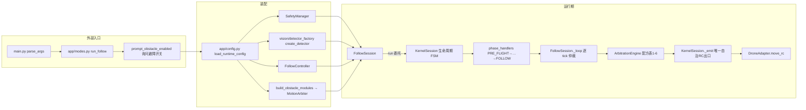

# PhantomFilmer 代码调研文档 · 总入口

> 本文档是对 PhantomFilmer 当前工作树的从功能出发、由外到内的代码调研；以源码为唯一事实源。

## 0. 阅读导航

| 你是谁 | 建议路径 |
|--------|----------|
| 第一次运行本项目的操作者 | 先读本文「系统是什么」→ [01-功能与运行模式](01-功能与运行模式.md) 的模式表与典型调用流程 |
| 使用本地真机 WebUI 的操作者 | [WebUI 真机操作指导书](WebUI真机检查指导书.md) |
| 想理解整体架构的维护者 | 本文「端到端链路」与「线程拓扑」→ [02-系统架构与生命周期](02-系统架构与生命周期.md) |
| 视觉 / ReID 相关开发 | [03-视觉感知与目标跟随](03-视觉感知与目标跟随.md) |
| 避障 / 搜索 / 仲裁相关开发 | [04-搜索避障与运动仲裁](04-搜索避障与运动仲裁.md) |
| 真机安全与边界 | [05-安全机制与硬件边界](05-安全机制与硬件边界.md) |
| 需要查配置键、测试或源码位置 | [06-配置测试与源码索引](06-配置测试与源码索引.md) |
| 从根 README 的 ReID / 避障小节进入 | 直接落在 [03](03-视觉感知与目标跟随.md)（ReID 材料与跟随）、[04](04-搜索避障与运动仲裁.md)（避障流程）、[01](01-功能与运行模式.md)（reid-demo 演练） |

## 1. 系统是什么

**PhantomFilmer** 是一个面向 **RoboMaster TT / Tello Talent** 无人机的自动跟拍系统 **Python 原型**。核心能力：开启视频流 → 人物 ReID → 起飞并闭环到基础悬停高度 → 普通/侧向/前向三种自动跟随 → 目标丢失时有界搜索 → 可选前向 ToF 避障 → 电量/高度/超时安全降落。仓库还提供一个只绑定本机回环地址的真机 WebUI，用于预检、起降、视频和手动 RC 控制。

- **CLI 单进程**：命令行飞行逻辑运行在一个 Python 进程内，通过 UDP（`djitellopy` SDK）与无人机通信。
- **WebUI 本机双进程**：启动脚本同时运行 Python 真机 API（`127.0.0.1:8765`）和 Next.js 前端（`127.0.0.1:3000`），不监听外网地址。
- **原型而非产品**：当前能力边界与未实现项见 [05-安全机制与硬件边界](05-安全机制与硬件边界.md)。

## 2. 外部功能地图

CLI 入口 `main.py::main` 根据 `--mode` 分发到 `app/modes.py::run_*`。13 种模式分为几类：

- **描述 / 诊断**：`demo`（默认，只 describe 系统）、`status`、`connection-test`
- **摄像头**：`camera`（地面 ReID 预览）
- **飞行**：`follow`、`fixed-demo`、`basic-flight-test`（真机确认后起飞悬停 5 s）、`reid-demo`
- **只算不飞**：`follow-dry-run`（复用生产仲裁、不起飞不发 RC）
- **纯测试**：`follow-test`、`safety-test`（不起飞）
- **交互控制台**：`console`（本地规则 + LLM 回退）
- **数据准备**：`reid-enroll`（创建本地人物档案，不连无人机）

完整模式矩阵、参数与副作用见 [01-功能与运行模式](01-功能与运行模式.md)。

WebUI 不属于 `--mode` 矩阵，也不运行 ReID 自动跟随；它是独立的真机手动控制入口。安装、预检和操作流程见 [WebUI 真机操作指导书](WebUI真机检查指导书.md)。

## 3. 端到端链路

以默认避障关闭时的 `follow` 为例（[app/modes.py:272](../app/modes.py#L272)）：

## 4. 混合架构：兼容 facade + 精简内核

`FollowSession`（[control/follow_session.py:42](../control/follow_session.py#L42)，2265 行）是 **兼容性门面**：保留构造签名、UI/遥测、三种跟随模式、传感器、阻塞子循环和大量状态，其 `run()` 直接委托给 `KernelSession`。

`KernelSession`（[control/kernel/session.py:19](../control/kernel/session.py#L19)）是**精简内核**：拥有生命周期 phase FSM、唯一自治 RC 发射缝（`_emit`）、feature fail-safe（`_failsafe`）和 finally 清理。详见 [02-系统架构与生命周期](02-系统架构与生命周期.md)。

> **重要边界**：CLI `FollowSession` 的自治运动与安全清零都经 `KernelSession._emit`；但它仍不是全仓库唯一 `move_rc` 调用点，Console 的 `_send_safe_rc` 与独立 WebUI 服务各自拥有经限幅的直接出口。

## 5. 线程拓扑

| 线程 | 创建处 | 职责 | 备注 |
|------|--------|------|------|
| 主线程 | `main.py` | 模式分发、飞行循环 | 阻塞式逐 tick 循环 |
| 控制台跟随任务线程 | [console/tools.py:129](../console/tools.py#L129) | 运行一个 `FollowSession`（`run()`） | 仅 console 模式；非 daemon |
| 前向 ToF 采样线程 | [drone/front_tof.py:76](../drone/front_tof.py#L76) | 后台轮询 `EXT tof?`，维护缓存快照 | daemon |
| JSONL 日志写线程 | [control/motion_arbiter.py:462](../control/motion_arbiter.py#L462) | 有界队列异步写 `logs/avoidance/*.jsonl` | daemon；丢事件不阻塞控制 |
| 朝向跟随日志线程 | [control/side_follow_logging.py:274](../control/side_follow_logging.py#L274) | 异步写 `logs/side_follow/*.jsonl` | daemon；侧向与前向模式共用记录器实现 |
| 视频读取线程 | `djitellopy` 内部 | 从无人机读取视频帧 | 由 SDK 管理 |

WebUI 另有 HTTP 请求线程、0.4 s RC 看门狗线程和前向 ToF 轮询线程；它们属于独立的 `web_api.server` 进程，不与 CLI 飞行会话并存。

## 6. 能力地图（按功能到代码）

| 功能 | 主要代码 | 规范文档 |
|------|----------|----------|
| 运行模式与 CLI | `main.py`、`app/modes.py` | [01](01-功能与运行模式.md) |
| 依赖装配 | `app/builder.py` | [02](02-系统架构与生命周期.md) |
| 生命周期 | `control/kernel/session.py`、`phase_handlers/` | [02](02-系统架构与生命周期.md) |
| 逐 tick 仲裁 | `control/kernel/arbitration.py` | [04](04-搜索避障与运动仲裁.md) |
| 视觉检测 | `vision/*_detect.py`、`detector_factory.py` | [03](03-视觉感知与目标跟随.md) |
| 人物 ReID | `person_reid_detect.py`、`reid_enrollment.py`、`reid_profiles.py` | [03](03-视觉感知与目标跟随.md) |
| 跟随控制 | `control/follow_control.py` | [03](03-视觉感知与目标跟随.md) |
| 朝向跟随 | `control/side_follow_control.py`、`side_follow_logging.py` | [03](03-视觉感知与目标跟随.md) |
| 有界搜索 | `control/target_search.py` | [04](04-搜索避障与运动仲裁.md) |
| 避障规划 | `control/obstacle_avoidance.py`、`motion_arbiter.py` | [04](04-搜索避障与运动仲裁.md) |
| 前向 ToF | `drone/front_tof.py` | [04](04-搜索避障与运动仲裁.md) |
| 安全 | `drone/safety.py` | [05](05-安全机制与硬件边界.md) |
| 无人机适配 | `drone/*_adapter.py` | [05](05-安全机制与硬件边界.md) |
| 控制台 | `console/*` | [01](01-功能与运行模式.md) |
| 本地真机 WebUI | `web_api/*`、`webui/*`、`scripts/*webui.sh` | [WebUI 指导书](WebUI真机检查指导书.md) |
| 配置 | `app/config.py`、`config.yaml` | [06](06-配置测试与源码索引.md) |
| 测试 | `tests/` | [06](06-配置测试与源码索引.md) |

## 7. 关键边界与限制摘要（详见各篇）

1. **避障输入不是视觉**：障碍信号仅来自 RoboMaster TT 顶部扩展前向 ToF，`DistanceOnlyObstacleDetector` 不分析任何像素（[vision/obstacle_detect.py:108](../vision/obstacle_detect.py#L108)）。
2. **ToF 盲区**：顶部 ToF 不能保护后方、侧方、上方、下方；1 m 侧移是速度—时间估算，非里程计实测。
3. **ReID 是唯一识别能力**：只做外观匹配，不识别真实姓名；俯视/遮挡/换衣/逆光/低分辨率都不可靠。
4. **`--lock-frames` 是兼容参数**：被解析（[main.py:112](../main.py#L112)）但在 `run_reid_demo` 中 `del lock_frames` 不参与流程（[app/modes.py:425](../app/modes.py#L425)）。
5. **初始 ReID 接受**：当前实现可在单个 fresh 帧后进入 FOLLOWING（受相似度阈值与歧义 margin 约束）；`reacquire_frames=5` 主要约束搜索后的重新确认，不是“起飞前连续五帧锁定”。
6. **RC 出口按运行时隔离**：CLI `FollowSession` 经 `_emit`，Console 工具和 WebUI 服务各有自己的安全出口；三个入口不能同时控制同一真机。
7. **测试状态**：测试覆盖软件链路，但未覆盖真机/Wi-Fi/真实 ToF 与真实人物视频，详见 [06](06-配置测试与源码索引.md) §5。
8. **朝向模式绕过避障**：侧向和前向跟随直接使用朝向控制器及共用有界搜索，不进入 `ArbitrationEngine` 的顶部 ToF 避障路径。
9. **初始前向选择缺口**：等待界面能返回 `front`，但当前 `ControlReadyHandler` 未将其推进到 `FOLLOW`；实际操作先按 `A` 进入普通自动，再按 `3` 安全切到前向模式。

## 8. 文档维护规则

- 完整模式表只维护在 **01**；完整配置值/源码索引只维护在 **06**；完整状态机/仲裁只维护在 **02/04**。
- 每篇文档区分事实边界：**当前实现 / 配置当前值 / 代码缺省 / 运行时覆盖 / 兼容行为 / 已知限制 / 历史线索 / 未验证假设**。
- 源码引用采用“仓库相对路径 + 符号名 + 行号”，行号以本文档生成时的 HEAD 为准；重命名或重构后需重新核对。
- 根 README 中指向旧文档的三个链接已改为指向本目录的规范文档（ReID 材料 → 03/06，reid 演练 → 01/03/05，避障 → 04）；不再保留独立兼容页。
